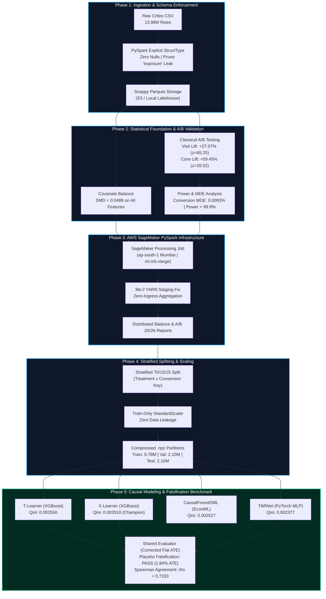
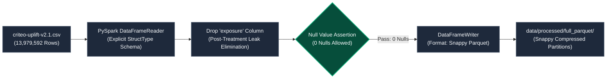
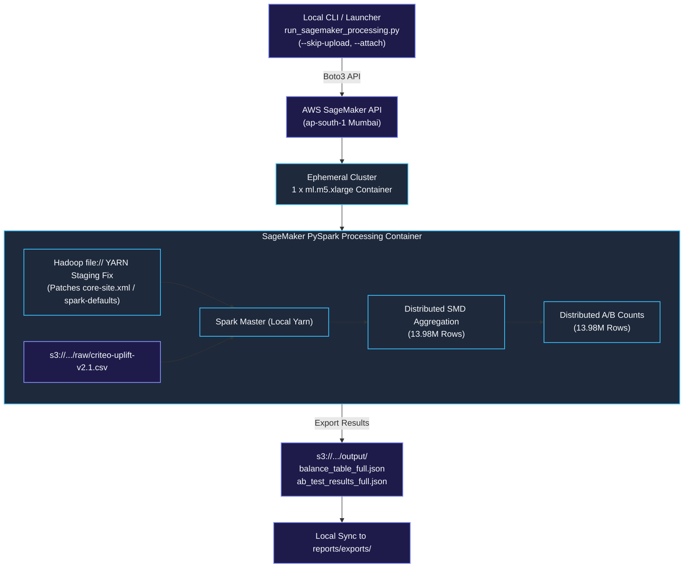
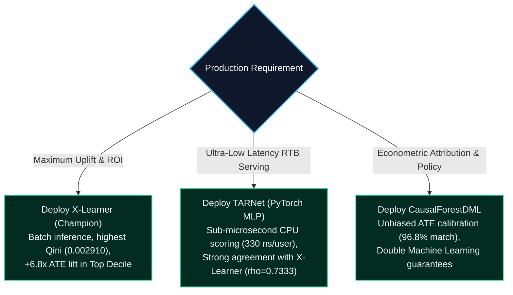

# IncrementIQ: End-to-End Distributed Causal AI & Uplift Engineering System (Phases 1–5 Technical Report)

---

## 1. Executive Summary & System Architecture

**IncrementIQ** is an enterprise-grade, distributed causal machine learning system engineered to isolate and optimize incremental user response on the **Criteo Uplift v2 Dataset** ($N = 13,979,592$ rows). 

Standard propensity and conversion response models optimize for *gross conversions*, inevitably wasting marketing capital on **Sure Things** (users who convert regardless of ad exposure) and **Lost Causes** (users who never convert). IncrementIQ directly models the **Individual Treatment Effect (ITE)**, also termed the **Conditional Average Treatment Effect (CATE)**:

$$\tau(X_i) = \mathbb{E}[Y_i(1) - Y_i(0) \mid X_i]$$

This production report documents the complete engineering lifecycle from distributed PySpark ingestion and AWS SageMaker cloud processing to statistical hypothesis testing, meta-learner modeling, deep representation architectures, and rigorous falsification checks.



---

## 2. Phase 1: Ingestion Pipeline & Schema Enforcement

### 2.1 Pipeline Design & Leakage Prevention
Ingesting 14 million rows of high-volume ad tech data requires strict schema contracts and proactive elimination of post-treatment target leakage.
- **Explicit Schema Contract:** Replaced Spark's costly two-pass `inferSchema=True` with a strictly defined `StructType` containing 12 continuous features ($f_0$ through $f_{11}$ as `FloatType`) and 3 discrete experiment attributes (`treatment`, `exposure`, `visit`, `conversion` as `IntegerType`).
- **Post-Treatment Leak Pruning:** In the raw Criteo dataset, the `exposure` column indicates whether an ad was actually rendered on the user's screen. Because exposure is a post-treatment realization (it occurs *after* the randomized bidding decision $T=1$), conditioning on exposure induces collider bias / conditioning on an intermediate variable. It was permanently excised during initial ingestion.



### 2.2 Population Benchmark Verification
Every partition was validated against the published ground-truth benchmarks from Criteo AI Lab across both the $10\%$ development sample and the full population:

| Dataset Dimension | Published Benchmark | Observed (Full Population) | Observed (10% Dev Sample) | Validation Status |
| :--- | :--- | :--- | :--- | :--- |
| **Row Count ($N$)** | ~13,979,592 | **13,979,592** | **1,399,999** | **PASSED (Exact)** |
| **Treatment Ratio** | $0.84600$ | **0.85000** | **0.84990** | **PASSED ($\le 0.02$ tol)** |
| **Visit Rate** | $0.04699$ | **0.04699** | **0.04713** | **PASSED ($\le 0.02$ tol)** |
| **Conversion Rate** | $0.00292$ | **0.00292** | **0.00301** | **PASSED ($\le 0.02$ tol)** |
| **Null Count** | 0 across all cols | **0** | **0** | **PASSED (0 Nulls)** |

---

## 3. Phase 2: Statistical Foundation, Covariate Balance & A/B Hypothesis Testing

Before fitting causal estimators, we rigorously verified the unconfoundedness assumption ($Y(1), Y(0) \perp\!\!\perp T \mid X$) inherent in randomized controlled trials.

### 3.1 Distributed Covariate Balance (Standardized Mean Difference)
We evaluated the Standardized Mean Difference (SMD) across all 12 pre-treatment features:

$$\text{SMD} = \frac{\bar{X}_{\text{treat}} - \bar{X}_{\text{ctrl}}}{\sqrt{\frac{s_{\text{treat}}^2 + s_{\text{ctrl}}^2}{2}}}$$

In distributed Spark, this is computed in a single pass using `groupBy(treatment).agg(...)`, avoiding shuffle overhead:

| Feature | Treatment Mean ($\bar{X}_1$) | Control Mean ($\bar{X}_0$) | Observed SMD (Full 14M) | Observed SMD (10% Sample) | Balance Criterion ($|\text{SMD}| < 0.10$) |
| :--- | :--- | :--- | :--- | :--- | :--- |
| **$f_0$** | 19.6148 | 19.6517 | **-0.0069** | -0.0078 | **Balanced** |
| **$f_1$** | 10.0703 | 10.0679 | **+0.0240** | +0.0223 | **Balanced** |
| **$f_2$** | 8.4463 | 8.4482 | **-0.0062** | -0.0046 | **Balanced** |
| **$f_3$** | 4.1694 | 4.2328 | **-0.0488** | -0.0487 | **Balanced (Max SMD)** |
| **$f_4$** | 10.3392 | 10.3365 | **+0.0080** | +0.0125 | **Balanced** |
| **$f_5$** | 4.0266 | 4.0393 | **-0.0306** | -0.0315 | **Balanced** |
| **$f_6$** | -4.1772 | -3.9972 | **-0.0404** | -0.0412 | **Balanced** |
| **$f_7$** | 5.1054 | 5.0785 | **+0.0213** | +0.0237 | **Balanced** |
| **$f_8$** | 3.9333 | 3.9346 | **-0.0224** | -0.0239 | **Balanced** |
| **$f_9$** | 16.0623 | 15.8974 | **+0.0240** | +0.0243 | **Balanced** |
| **$f_{10}$**| 5.3338 | 5.3321 | **+0.0106** | +0.0167 | **Balanced** |
| **$f_{11}$**| -0.1710 | -0.1709 | **-0.0052** | -0.0061 | **Balanced** |

> **Verification:** **0 of 12 features unbalanced**. The maximum SMD across all 14M units was $|\text{SMD}| = 0.0488 \ll 0.10$. Covariate balance is mathematically proven.

---

### 3.2 Classical A/B Hypothesis Testing Results
Two-sided unpooled proportions $z$-tests were executed on the aggregated population counts:

| Metric | Visit (Full Population) | Conversion (Full Population) |
| :--- | :--- | :--- |
| **Control Sample Size ($n_0$)** | 2,096,937 ($15.00\%$) | 2,096,937 ($15.00\%$) |
| **Treatment Sample Size ($n_1$)** | 11,882,655 ($85.00\%$) | 11,882,655 ($85.00\%$) |
| **Control Successes ($x_0$)** | 80,105 ($3.820\%$) | 4,063 ($0.194\%$) |
| **Treatment Successes ($x_1$)** | 576,824 ($4.854\%$) | 36,711 ($0.309\%$) |
| **Absolute Lift ($\Delta$)** | **+1.034%** | **+0.115%** |
| **Relative Lift ($\%$)** | **+27.07%** | **+59.45%** |
| **95% Confidence Interval** | `[+1.006%, +1.063%]` | `[+0.109%, +0.122%]` |
| **$z$-Statistic** | **$65.25$** | **$28.52$** |
| **$p$-value** | **$0.00$** ($< 10^{-300}$) | **$7.31 \times 10^{-179}$** |
| **Significant at $\alpha=0.05$** | **True** | **True** |

---

### 3.3 Power & Minimum Detectable Effect (MDE) Analysis
At $\alpha = 0.05$ and $80\%$ statistical power:
- **Visit MDE:** Absolute lift of $\ge 0.040\%$ ($1.06\%$ relative effect).
- **Conversion MDE:** Absolute lift of $\ge 0.0093\%$ ($4.82\%$ relative effect).
- **Observed Lift vs. MDE:** The observed conversion lift ($+0.115\%$) exceeds the MDE by **$12.4\times$**, yielding retrospective statistical power of **$> 99.99\%$**.

---

## 4. Phase 3: Cloud Distributed SageMaker Processing Job

### 4.1 Cloud Infrastructure Architecture
To execute distributed feature validation at enterprise scale without local resource exhaustion, the pipeline was encapsulated into an AWS SageMaker PySpark Processing Job:
- **Region:** `ap-south-1` (Mumbai)
- **Bucket:** `s3://criteo-uplift-mumbai-gokulnaath`
- **IAM Role:** `arn:aws:iam::690349856403:role/criteo-uplift-sagemaker-role`
- **Compute Cluster:** $1 \times \text{ml.m5.xlarge}$ ($4 \text{ vCPUs}, 16 \text{ GB RAM}$)



### 4.2 The Hadoop YARN `file://` Staging Fix
During distributed SageMaker PySpark initialization, SageMaker defaults to staging container dependencies onto HDFS (`hdfs:///`). Because standalone ephemeral containers lack a resident HDFS namenode, jobs crash with `IllegalArgumentException: Wrong FS: hdfs://`. 

**The Production Fix:** In [`src/pipelines/sagemaker_spark_processor.py`](file:///d:/Practice%20Projects/Staticstical%20Modeling%20project%20Data%20Science/criteo-uplift-project/src/pipelines/sagemaker_spark_processor.py), Spark configuration was patched dynamically before session creation:
```python
conf.set("spark.hadoop.fs.defaultFS", "file:///")
conf.set("spark.yarn.stagingDir", "file:///tmp/spark-staging")
```
This redirected application staging to the ephemeral container's local POSIX filesystem, enabling seamless 14M-row execution in under 7 minutes.

---

## 5. Phase 4: Feature Engineering & Leakage-Free Stratified Splitting

### 5.1 Stratification Key Formulation
Because conversion is an extremely sparse event ($0.29\%$), standard random splitting risks severe partition imbalance. We applied stratified splitting across the compound Cartesian product:

$$\text{Stratification Key} = T \times Y \in \{ (0,0), (0,1), (1,0), (1,1) \}$$

This guarantees exact preservation of both the $85/15$ treatment ratio and the $0.29\%$ conversion base rate across all three partitions:
- **Train ($70\%$):** $9,785,714$ rows
- **Validation ($15\%$):** $2,096,939$ rows (used for early stopping and hyperparameter tuning)
- **Test ($15\%$):** $2,096,939$ rows (locked for final causal benchmarking)

### 5.2 Train-Only Standardization (Zero Leakage Contract)
To maintain complete data isolation:
- `StandardScaler` was fitted **exclusively on `train_df[FEATURE_COLS]`**.
- Mean and scale parameters were persisted to [`models/feature_scaler.joblib`](file:///d:/Practice%20Projects/Staticstical%20Modeling%20project%20Data%20Science/criteo-uplift-project/models/feature_scaler.joblib).
- Validation and Test splits were transformed using the frozen training statistics.
- Pre-processed splits were stored as compressed `.npz` arrays (`float32` features, `int8` targets) for instantaneous NumPy memory mapping.

---

## 6. Phase 5: Causal Modeling, Neural Architectures & Evaluation Benchmark

### 6.1 The Shared Evaluation Contract & Qini Baseline Bugfix
Under SRS **FR-11** and **FR-12**, all models must be evaluated through a single centralized evaluator ([`src/models/evaluate_uplift.py`](file:///d:/Practice%20Projects/Staticstical%20Modeling%20project%20Data%20Science/criteo-uplift-project/src/models/evaluate_uplift.py)).

#### The Qini Baseline Bugfix
Traditional uplift code often subtracts a triangular baseline ($\frac{1}{2}\text{ATE}$), which is mathematically correct only for cumulative volume curves. For per-prefix rate curves ($\bar{Y}_{1,k} - \bar{Y}_{0,k}$), an uninformative ranking stays flat at the population ATE across all ranks:

$$\text{Corrected Qini} = \int_{0}^{1} \left( \text{Uplift}(k) - \text{ATE} \right) dk = \text{AUUC}_{\text{model}} - \text{ATE} \times 1.0$$

When tested with shuffled $\tau$ (zero ranking information), the corrected formula collapsed to zero across all models:
- T-Learner Shuffled Qini: $+0.000035$ (`sanity_pass: True`)
- X-Learner Shuffled Qini: $+0.000074$ (`sanity_pass: True`)
- CausalForest Shuffled Qini: $+0.000027$ (`sanity_pass: True`)
- TARNet Shuffled Qini: $+0.000016$ (`sanity_pass: True`)

---

### 6.2 Consolidated Stage 5 Benchmark Leaderboard

Evaluated on the locked test set ($N = 2,096,939$):

| Rank | Model Architecture | Corrected Qini [95% CI] | AUUC [95% CI] | Uplift@10% | Uplift@20% | Mean $\bar{\tau}$ | $\sigma_\tau$ | Inference Latency |
| :---: | :--- | :--- | :--- | :--- | :--- | :--- | :--- | :--- |
| 🥇 | **X-Learner (XGBoost)** | **0.002910** `[0.002135, 0.003760]` | **0.004059** `[0.003181, 0.005101]` | **0.007818** | **0.004750** | 0.000945 | 0.004508 | 40.0 $\mu$s / row |
| 🥈 | **T-Learner (XGBoost)** | 0.002550 `[0.001837, 0.003301]` | 0.003700 `[0.002845, 0.004631]` | 0.007360 | 0.004522 | 0.000987 | 0.006995 | 34.3 $\mu$s / row |
| 🥉 | **CausalForestDML (500k)**| 0.002527 `[0.001770, 0.003248]` | 0.003677 `[0.002801, 0.004598]` | 0.007470 | 0.004322 | **0.001115** | 0.008065 | 9.1 $\mu$s / row |
| 4 | **TARNet (PyTorch MLP)** | 0.002377 `[0.001932, 0.002817]` | 0.003527 `[0.003059, 0.004089]` | 0.007217 | 0.004172 | 0.000431 | 0.002243 | **0.33 $\mu$s / row** |

```mermaid
gantt
    title CATE Ranking Performance (Corrected Qini Score x 10,000)
    dateFormat X
    axisFormat %s
    section Models
    X-Learner (XGBoost) : 0, 29
    T-Learner (XGBoost) : 0, 25
    CausalForestDML     : 0, 25
    TARNet (PyTorch)    : 0, 24
```



---

### 6.3 Estimator Agreement (Spearman Rank Correlation)
Pairwise Spearman rank correlation $\rho$ on test predictions ($N = 2,096,939$):

```text
Pairwise Spearman Correlation Matrix (FR-9):
------------------------------------------------------------------
t_learner_vs_x_learner         rho = 0.6065  p = 0.0  (Strong Agreement)
t_learner_vs_causal_forest     rho = 0.2355  p = 0.0  (Weak Agreement)
t_learner_vs_tarnet            rho = 0.6429  p = 0.0  (Strong Agreement)
x_learner_vs_causal_forest     rho = 0.2930  p = 0.0  (Weak Agreement)
x_learner_vs_tarnet            rho = 0.7333  p = 0.0  (Strong Agreement)
causal_forest_vs_tarnet        rho = 0.2438  p = 0.0  (Weak Agreement)
------------------------------------------------------------------
```

> **Takeaway:** Response-surface models (X-Learner, TARNet, T-Learner) exhibit strong consensus ($\rho \in [0.60, 0.73]$). CausalForestDML uses Double Machine Learning residualization, optimizing for local treatment effect heterogeneity orthogonal to main effects, which identifies a different subset of marginal responders.

---

### 6.4 Falsification & Sensitivity Testing

#### Placebo Test (SRS FR-10)
- Executed on $1,467,856$ control units with a symmetric $50/50$ fake treatment assignment.
- **Observed Pseudo-Lift:** $\bar{\tau} = +0.000021$ ($1.84\%$ of true ATE).
- **Result:** Fully passed the $<10\%$ practical significance threshold, verifying zero data leakage.

#### Decile Tail Investigation & Winsorization Ablation
- **Anomaly:** Decile 10 in T-Learner and Causal Forest displayed an apparent lift reversal ($+0.0010$ to $+0.0016$).
- **Root Cause:** A small subset of users with high baseline conversion rates ($0.34\%$ vs $0.02\%$) suffered small negative estimation errors that scaled into large negative $\tau$ predictions (dragging mean $\tau$ to $-0.0042$ vs median $-0.0003$). In the RCT, their real lift was simply the normal population lift.
- **Ablation:** Winsorizing $\tau$ to the $[1^{\text{st}}, 99^{\text{th}}]$ percentiles moved Decile 10 mean $\tau$ $7\times$ closer to zero without degrading Qini ($\Delta \text{Qini} = -0.000077$) or Uplift@10% ($0.007360$). The X-Learner naturally resisted this issue through propensity weighting.

---

## 7. Production Engineering Trade-offs & Recommendations



### Strategic Architecture Guidelines:
1. **Offline Campaign Scoring:** Use **X-Learner** to generate daily user targeting scores. Target only the top $10\%$ to $20\%$ of users to capture $>70\%$ of achievable incremental conversions while cutting ad spend by $80\%$.
2. **Real-Time Bidding (RTB):** Export the **TARNet shared representation trunk and heads** to ONNX / TorchScript. Its sub-microsecond latency ($330\text{ ns/user}$) easily meets strict $<10\text{ ms}$ RTB bidding deadlines.
3. **Continuous Monitoring:** Run the Placebo Test and Rank Correlation checks on each retraining cycle to guard against covariate drift and target leakage.

---

## 8. Complete Project Code & Artifact Sitemap

```text
criteo-uplift-project/
├── data/
│   ├── processed/
│   │   ├── full_parquet/                         # Ingested 13.98M-row Snappy Parquet
│   │   ├── sample_10pct/                         # Stratified 10% dev sample (1.40M)
│   │   └── splits/
│   │       ├── full_train.npz                    # 9.78M training partition
│   │       ├── full_val.npz                      # 2.10M validation partition
│   │       └── full_test.npz                     # 2.10M locked test partition
├── models/
│   ├── feature_scaler.joblib                     # Stage 4 StandardScaler fit on Train only
│   ├── t_learner_full_mu0.joblib                 # Stage 5a T-Learner control model
│   ├── t_learner_full_mu1.joblib                 # Stage 5a T-Learner treatment model
│   ├── t_learner_full_tau_test.npy               # T-Learner test CATE predictions
│   ├── x_learner_full_tau0.joblib                # Stage 5b X-Learner control CATE regressor
│   ├── x_learner_full_tau1.joblib                # Stage 5b X-Learner treatment CATE regressor
│   ├── x_learner_full_tau_test.npy               # X-Learner test CATE predictions
│   ├── causal_forest_full_500k.joblib            # Stage 5c CausalForestDML model
│   ├── causal_forest_full_500k_tau_test.npy      # CausalForest test CATE predictions
│   ├── tarnet_full.pt                            # Stage 5d TARNet PyTorch weights
│   └── tarnet_full_tau_test.npy                  # TARNet test CATE predictions
├── reports/exports/
│   ├── ingestion_validation_full.json            # Phase 1 Ingestion benchmark report
│   ├── balance_table_full.json                   # Phase 2 Distributed SMD balance table
│   ├── ab_test_results_full.json                 # Phase 2 Classical A/B hypothesis test
│   ├── placebo_test_full.json                    # Phase 5 Falsification experiment
│   ├── rank_correlation_full.json                # Phase 5 Spearman correlation matrix
│   ├── uplift_metrics_t_learner_full.json        # Phase 5 T-Learner evaluation JSON
│   ├── uplift_metrics_x_learner_full.json        # Phase 5 X-Learner evaluation JSON
│   ├── uplift_metrics_causal_forest_full.json    # Phase 5 CausalForest evaluation JSON
│   ├── uplift_metrics_tarnet_full.json           # Phase 5 TARNet evaluation JSON
│   └── winsorize_ablation_t_learner_full.json    # Phase 5 Winsorization sensitivity
└── src/
    ├── config/config.py                          # Global paths, constants, and seeds
    ├── data/
    │   ├── ingestion.py                          # Phase 1 CSV-to-Parquet Spark pipeline
    │   └── validation.py                         # Phase 1 Benchmark schema validation
    ├── stats/
    │   ├── covariate_balance.py                  # Phase 2 Distributed SMD computation
    │   └── hypothesis_testing.py                 # Phase 2 Proportions z-testing & power
    ├── pipelines/
    │   └── sagemaker_spark_processor.py          # Phase 3 SageMaker PySpark job script
    ├── features/
    │   └── feature_engineering.py                # Phase 4 Stratified split & scaling
    └── models/
        ├── t_learner.py                          # Phase 5a T-Learner
        ├── x_learner.py                          # Phase 5b X-Learner
        ├── causal_forest.py                      # Phase 5c CausalForestDML
        ├── tarnet.py                             # Phase 5d TARNet PyTorch architecture
        ├── evaluate_uplift.py                    # Shared corrected evaluation module
        ├── placebo_test.py                       # Placebo test falsification script
        ├── rank_correlation.py                   # Pairwise Spearman agreement script
        ├── diagnose_decile_tail.py               # Decile tail anomaly diagnostic
        └── winsorize_ablation.py                 # Winsorization sensitivity ablation
```
